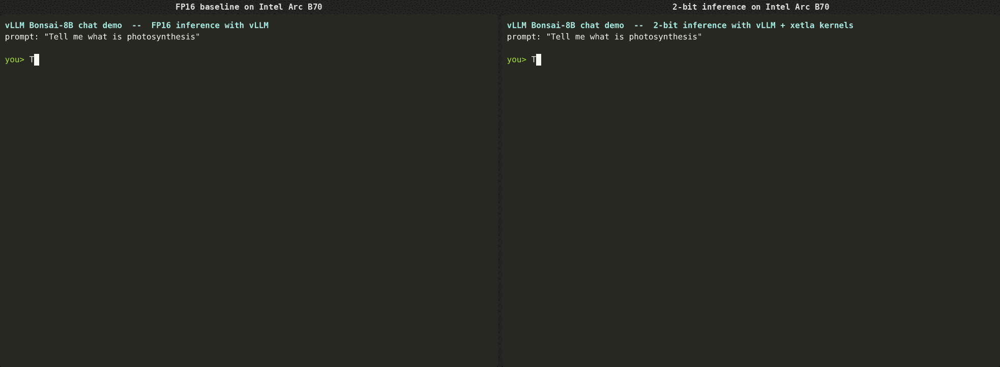
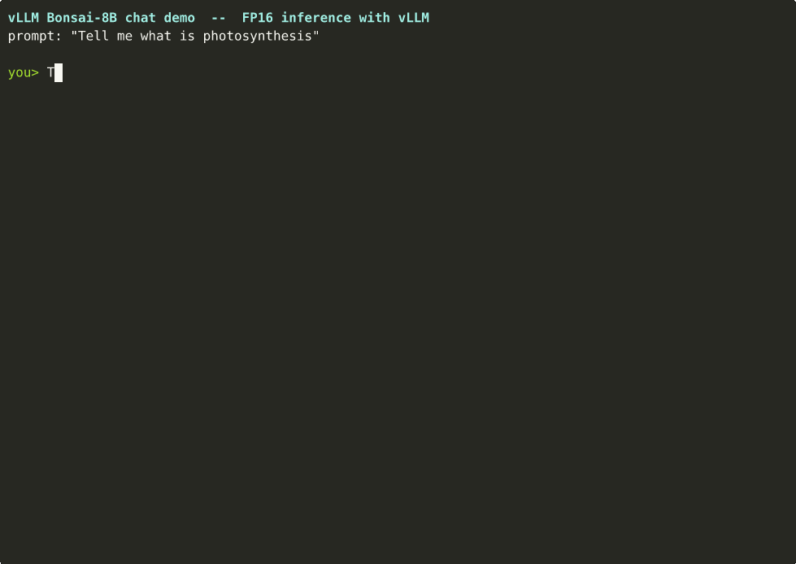
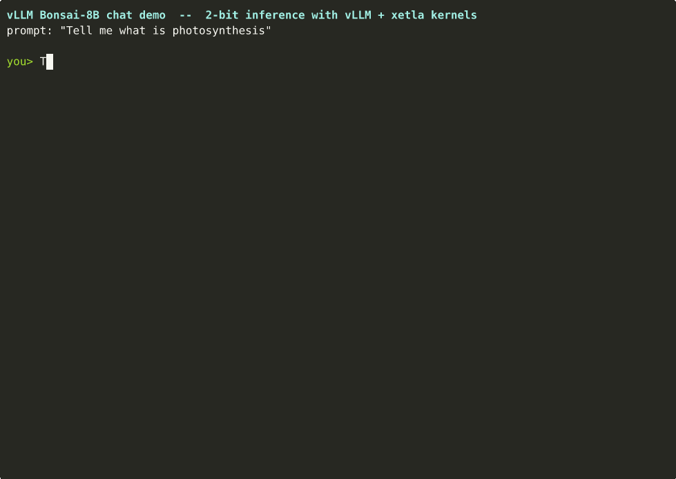

# Bonsai-8B int2 vs fp16 demo on Intel Xe2 (vLLM + xetla plugin)

This directory contains a self-contained demo that records two terminal-style
GIFs of `vllm` chat with the same prompt:

| Variant                 | Decode tok/s | Speedup |
|-------------------------|-------------:|--------:|
| `fp16` baseline (Xe2)   |        36.52 |   1.00× |
| **`int2` (xetla, Xe2)** |   **157.70** | **4.32×** |



Individual recordings:

| | |
|---|---|
|  |  |

Hardware: Intel Graphics `0xe223` (Xe2, 32.5 GB), oneAPI 2025.3, Intel GPU
26.05.37020.3 driver, level-zero v1.

Model: [`Ternary-Bonsai-8B-F16.gguf`](Ternary-Bonsai-8B-F16.gguf) (16 GB, Qwen3-8B
backbone, ternary fp16 weights). The xetla plugin re-quantizes ternary weights
losslessly to 2-bit codes with per-128-K fp16 scales and dispatches them to
`int2_fp16_upcvt_gemm` / `int2_fp16_dpas_gemm` on Xe2.

## Reproducing the demos

### 1. Prerequisites

- Linux, x86_64, an Intel Xe2 GPU (or any GPU vLLM supports — replace the
  device-selector lines for non-XPU runs).
- The repo's `.venv` set up per `utils/setup_vllm_xpu.sh`.
- The xetla plugin built and installed (`pip install -e .` at repo root).
- One-time tools to record / render / combine GIFs:

  ```bash
  source .venv/bin/activate
  python -m pip install asciinema imageio pillow numpy

  # `agg` (asciinema -> GIF) prebuilt binary:
  mkdir -p ~/.local/bin
  curl -sL -o ~/.local/bin/agg \
      https://github.com/asciinema/agg/releases/download/v1.5.0/agg-x86_64-unknown-linux-gnu
  chmod +x ~/.local/bin/agg

  # ImageMagick `convert` (or `magick`) for GIF optimization — usually already
  # installed; if not: sudo apt install imagemagick
  ```

### 2. Record the two cast files

The recorder script ([scripts/demo_record.py](scripts/demo_record.py)) writes
asciinema v2 cast files directly. The cast clock starts the moment the prompt
begins to be "typed" — model load is silenced to `/dev/null` first, so the
first frame is already at the chat prompt.

```bash
source /swtools/intel-gpu/26.05.37020.3/intel_gpu_vars.sh
source /swtools/intel/2025.3/oneapi-vars.sh --force
source .venv/bin/activate

# Common XPU env
export RenderCompressedBuffersEnabled=0 NEOReadDebugKeys=1 \
       VLLM_XPU_ENABLE_XPU_GRAPH=1 \
       ONEAPI_DEVICE_SELECTOR=level_zero:0

# --- int2 path (xetla plugin) -----------------------------------------
export XETLA_QUANT_METHOD=int2_f16 VLLM_QUANTIZATION=xetla
python scripts/demo_record.py \
    --label "int2 (xetla, Xe2)" \
    --quantization xetla \
    --out demo_int2.cast

# --- fp16 baseline -----------------------------------------------------
unset XETLA_QUANT_METHOD VLLM_QUANTIZATION
python scripts/demo_record.py \
    --label "fp16 baseline (Xe2)" \
    --quantization none \
    --out demo_fp16.cast
```

The same prompt — `Tell me how CPU caches work` — is used by default with
`temperature=0` so both runs decode the *same* 256 tokens.

Useful flags:

| Flag | Default | Notes |
|---|---|---|
| `--prompt` | `Tell me how CPU caches work` | Any text. |
| `--max-tokens` | `256` | Generation length. |
| `--type-cps` | `18.0` | Characters/sec when "typing" the prompt. |
| `--quantization` | `xetla` | Use `none` for fp16. |
| `--temperature` | `0.0` | Deterministic by default. |
| `--enforce-eager` | off | Disable XPU graphs (not recommended). |

The script reports `[label] N tokens in Xs  Y tok/s (decode)` on the final
frame of the cast. Decode tok/s is computed from the time between the **first
streamed token** and **completion** — it excludes the prefill, which matches
how Bonsai-style demos quote the metric.

### 3. Render each cast as a GIF

```bash
~/.local/bin/agg --theme monokai --font-size 16 --speed 1.0 \
    demo_int2.cast demo_int2.gif
~/.local/bin/agg --theme monokai --font-size 16 --speed 1.0 \
    demo_fp16.cast demo_fp16.gif

# Optional: shrink ~10× with no visible loss
convert demo_int2.gif -coalesce -layers Optimize demo_int2.gif
convert demo_fp16.gif -coalesce -layers Optimize demo_fp16.gif
```

`agg` themes worth trying: `monokai`, `dracula`, `solarized-dark`, `nord`.

### 4. Combine the two GIFs side-by-side

```bash
python scripts/combine_gifs.py demo_fp16.gif demo_int2.gif demo_side_by_side.gif \
    --label-left  "fp16 baseline (Xe2)" \
    --label-right "int2 xetla (Xe2)" \
    --fps 20

convert demo_side_by_side.gif -coalesce -layers Optimize demo_side_by_side.gif
```

The combiner ([scripts/combine_gifs.py](scripts/combine_gifs.py)) re-samples
both inputs onto a uniform `--fps` timeline, holds the shorter clip on its
last frame, and adds a label bar above each panel. Both clips share the same
wall-clock so the perceived speedup is real (the int2 panel finishes its
output while the fp16 panel is still typing).

## Best-known config used

These were the env / build settings active when the demo was recorded:

- `XETLA_QUANT_METHOD=int2_f16`, `VLLM_QUANTIZATION=xetla` (per-K-group fp16
  scales, gs=128).
- `VLLM_XPU_ENABLE_XPU_GRAPH=1` (XPU graph capture; safe and ~equal to eager
  for int2 on this model — see the BKM section in the project notes).
- `ONEAPI_DEVICE_SELECTOR=level_zero:0` (single-driver init).
- `RenderCompressedBuffersEnabled=0 NEOReadDebugKeys=1` (recommended for
  current Intel GPU compute stack on Xe2).
- B7 + B8 plugin optimizations applied (`xetla_vllm_plugin.py`):
  - cached `_xetla_dpas_capable` per layer at load time,
  - `apply()` calls the kernel directly outside `torch.compile` tracing,
  - bias pre-converted to fp16 once at load.
- vLLM v0.19 V1 engine, `flash` attention backend (default).
- `temperature=0.0`, `max_tokens=256`, `--input-len`-equivalent prompt of ~7
  tokens.

## Files in this demo

| File | Purpose |
|---|---|
| [scripts/demo_record.py](scripts/demo_record.py) | Loads vLLM silently, records one cast file with prompt typing + streamed reply + tok/s. |
| [scripts/combine_gifs.py](scripts/combine_gifs.py) | Side-by-side GIF combiner with optional label bar. |
| [demo_int2.cast](demo_int2.cast) / [demo_int2.gif](demo_int2.gif) | int2 (xetla) recording. |
| [demo_fp16.cast](demo_fp16.cast) / [demo_fp16.gif](demo_fp16.gif) | fp16 baseline recording. |
| [demo_side_by_side.gif](demo_side_by_side.gif) | Combined comparison. |
