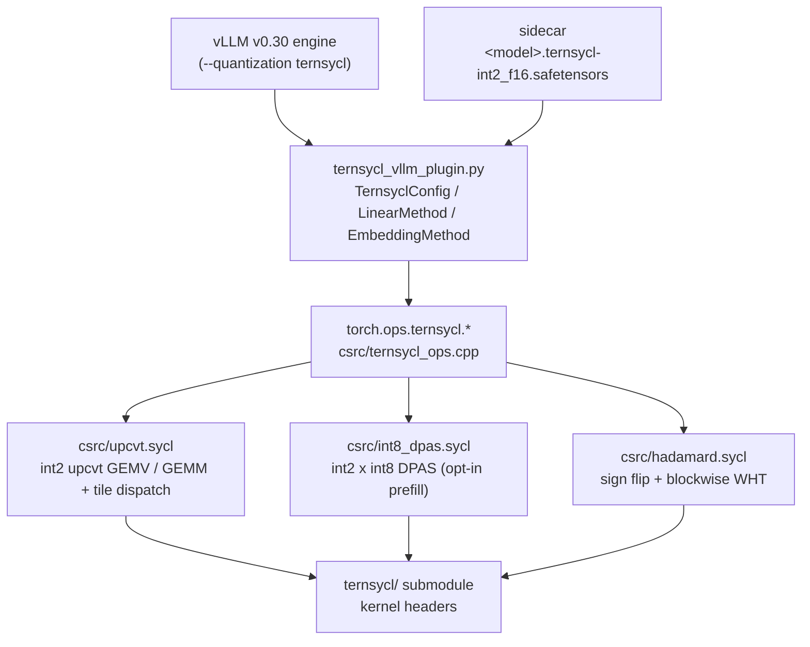

# TernSYCL vLLM plugin for Intel Xe2 GPUs

A vLLM general plugin that serves ternary checkpoints (weights in
`{-1, 0, +1}` × one fp16 scale per 128 input elements) on Intel Xe2 GPUs
(Arc Pro B70 / BMG, Arc 140V / Lunar Lake) with the
[TernSYCL](https://github.com/libxsmm/TernSYCL) kernels. It registers the
quantization method `ternsycl` (`--quantization ternsycl`).

Models covered: **Bonsai 2 27B** (Hadamard-rotated basis, step-by-step guide in
[BONSAI2.md](BONSAI2.md)), Bonsai 1 27B / 8B, and dense CAT-Q ternary exports
(`scripts/deploy_catq.sh`).

## Architecture



| Layer | Files | Role |
| --- | --- | --- |
| vLLM glue | [ternsycl_vllm_plugin.py](ternsycl_vllm_plugin.py) | quantization config, linear / lm_head / embedding methods, sidecar loader, Hadamard pre-transform, fused SwiGLU, tensor-parallel sharding, profiler |
| Torch ops | [csrc/ternsycl_ops.cpp](csrc/ternsycl_ops.cpp) | shape and dtype checks, output and scratch allocation, `TORCH_LIBRARY(ternsycl)` |
| Launchers + dispatch | [csrc/upcvt.sycl](csrc/upcvt.sycl), [csrc/int8_dpas.sycl](csrc/int8_dpas.sycl), [csrc/hadamard.sycl](csrc/hadamard.sycl) | pick a compiled tile per (M, K, N) and launch it on the current XPU stream |
| Kernels | [ternsycl/](ternsycl) (submodule) | SIMT SYCL kernels for Xe2: DPAS, 2D block I/O, fused epilogues |

### Ops

| `torch.ops.ternsycl.` | Computes | Used for |
| --- | --- | --- |
| `int2_fp16_upcvt_gemm_run(A, B, S, C?)` | `C = A · dequant(B, S)`, fp16 | every ternary linear layer and the lm_head |
| `int2_fp16_upcvt_gemm_postop_run(A, B, S, other, postop)` | same, epilogue `silu(acc)·other` (1) or `acc + other` (2) | SwiGLU folded into the gate projection |
| `int2_bf16_upcvt_gemm_run(A, B, S, C?)` | bf16 variant | natively bf16 checkpoints |
| `int2_fp16_dpas_gemm_run(A, B, S, C?)` | A quantized to int8 per (row, 128-group), s8 × s2 DPAS | prefill with `TERNSYCL_DISABLE_DPAS=0` |
| `hadamard_fwht_run(x, signs?, 1024, inverse)` | `H(s·x)/32` per 1024 block, or `s·H(x)/32` | rotated-basis checkpoints (Bonsai 2) |

The Python custom ops `torch.ops.ternsycl.{int2_fp16_upcvt_gemm,
int2_fp16_upcvt_postop_gemm, hadamard_fwht}` wrap them with fake (meta)
implementations, so the model graph compiles with `torch.compile`.

### Data layout

| Tensor | Type | Layout |
| --- | --- | --- |
| A (activations) | fp16 (bf16) | `[M, K]` row-major |
| B (`qweight`) | int32 | `[K/16, N]`: 2-bit codes `{0, 1, 3} = {0, +1, -1}` of K rows `16kp..16kp+15` of column n |
| S (`scale`) | fp16 (bf16) | `[K/128, N]` |
| C | fp16 (bf16) | `[M, N]` |

`K % 128 == 0` and `N % 16 == 0`; any M. The packed embedding table is row-major
(`[vocab, hidden/16]` words, `[vocab, hidden/128]` scales) and is unpacked per
looked-up token.

### Kernel dispatch

Tiles are compile-time template instances; [csrc/upcvt.sycl](csrc/upcvt.sycl)
selects one per call. The table was tuned on the B70 with the TernSYCL drivers
(≥ 2 GiB rotating weights, device-event times):

| M | Kernel | Tile |
| --- | --- | --- |
| 1 (decode) | GEMV, 1 row | per shape (NSG, LS, U), e.g. gate/up 5120×17408: 16 columns × 8-way K split |
| 2 – 8 | GEMV, SGM = 2/4/8 rows | per shape; qkv shapes switch to a 16-row M tile at M > 4 |
| 9 – 16 | M-tiled GEMM | 16 × 16 or 16 × 32 sub-group tile |
| 17 – 63 | M-tiled GEMM | 32 × 16 or 32 × 32 |
| ≥ 64 (prefill) | M-tiled GEMM, 256 GRF | 64 × 32, work-group shape per shape |

The int8 DPAS path quantizes A with a pre-kernel, then uses a GEMV (M ≤ 8) or
an 8 × 128 / 16 × 64 M tile. The Hadamard kernel is one work-group of 128
items per 1024-wide block.

### Weight flow

1. `create_weights`: for layers found in the sidecar, the dense parameter is a
   `meta` placeholder, so the fp16 model (~54 GB for 27B) is never allocated.
2. `process_weights_after_loading`: loads `qweight` / `scale` from the sidecar
   (sliced per tensor-parallel rank), attaches the Hadamard signs of folded
   layers, and splits `gate_up_proj` into gate and up for the fused SwiGLU.
   Layers not in the sidecar stay dense. Without a sidecar, ternary fp16
   weights are packed losslessly on load.
3. `apply`: optional Hadamard pre-transform, then the int2 GEMM. The lm_head
   and the input embedding are quantized as well (`TERNSYCL_QUANTIZE_LM_HEADS`).

The sidecar is a safetensors file with `<prefix>.qweight` and `<prefix>.scale`
per module, `hadamard.signs.<K>` tensors, and metadata keys `ternsycl_method`
(`int2_f16`), `ternsycl_format_version` and `ternsycl_meta` (JSON, including
the `prism.hadamard` contract).

## Build

Requirements: Intel GPU driver with Level Zero, oneAPI 2026.0 (`icpx`; it must
match the SYCL runtime that torch 2.13 xpu ships), Python ≥ 3.10, git, uv.

From scratch (clones this branch with the `ternsycl` submodule, creates
`.venv`, builds vLLM v0.30.0 for XPU and the plugin):

```bash
unset LD_LIBRARY_PATH
source /swtools/intel-gpu/latest/intel_gpu_vars.sh
source /swtools/intel/2026.0/oneapi-vars.sh --force
PLUGIN_BRANCH=feature/vllm-v0.30-ternsycl ./utils/setup_fresh.sh /path/to/empty/dir
```

Rebuilding the extension in an existing checkout:

```bash
git submodule update --init --recursive ternsycl
source .venv/bin/activate
python setup.py build_ext --inplace     # -> ternsycl_pt_ext.*.so
```

The kernels are compiled ahead of time for `TERNSYCL_AOT_DEVICES` (default
`bmg-g31,lnl-m`; e.g. `bmg-g21` for other BMG parts), one device image per
kernel. `TERNSYCL_ROOT` builds against another TernSYCL checkout. Do not
switch to JIT compilation: some bf16 kernels then run slower and change speed
from process to process. The link warns "Undefined function
intel_sub_group_..." for each IGC builtin; this is expected.

## Run

```bash
export TERNSYCL_PREQUANT_PATH=/path/to/<model>.ternsycl-int2_f16.safetensors
export VLLM_XPU_ENABLE_XPU_GRAPH=1 ONEAPI_DEVICE_SELECTOR=level_zero:gpu
python scripts/bench_model.py --model /path/to/<model>-packed --quantization ternsycl \
    --dtype bfloat16 --max-model-len 512 --cudagraph-sizes 1,2,4,8 --max-num-batched-tokens 512 \
    --deterministic-compile --max-tokens 256 --temperature 0.0 --full \
    --prompt "Tell me about photosynthesis in 200 words"
```

`scripts/run_bonsai2_gpu.sh` wraps this for a SLURM allocation (page-cache
eviction, stale-engine cleanup, memory-utilization choice); see
[BONSAI2.md](BONSAI2.md). Sidecars are produced by `scripts/pack_bonsai2_gguf.py`
(Bonsai 2 GGUF), `scripts/pack_bonsai_hf.py` (Bonsai 1 unpacked HF checkpoints)
and `scripts/deploy_catq.sh` (CAT-Q).

### Environment

| Variable | Default | Effect |
| --- | --- | --- |
| `TERNSYCL_PREQUANT_PATH` | unset | sidecar to load the packed weights from |
| `TERNSYCL_QUANT_METHOD` | from the sidecar, else `int2_f16` | `int2_f16`, or `bf16` (no quantization) |
| `TERNSYCL_PREQUANT_DUMP_PATH` | unset | write the weights packed on load to this sidecar |
| `TERNSYCL_QUANTIZE_LM_HEADS` | `1` | also pack the lm_head and the input embedding |
| `TERNSYCL_FUSE_SWIGLU` | `1` | split gate_up and fold `silu(gate)·up` into the gate GEMM epilogue |
| `TERNSYCL_DISABLE_DPAS` | `1` | `0` runs prefill (M > 1) on the int8 DPAS kernel; ~1.3% relative error per GEMM, which some models do not tolerate |
| `TERNSYCL_HADAMARD_IMPL` | `fused` | `matmul`: reference implementation (signs × dense H_1024 matmul) |
| `TERNSYCL_HADAMARD_DTYPE` | `fp32` | precision of the matmul reference |
| `TERNSYCL_PROFILE` | `0` | `1`: per-op and per-shape GEMM time and bandwidth table at exit |
| `TERNSYCL_DEBUG`, `TERNSYCL_TIMINGS` | `0` | load-time logging, per-call host timings |
| `TERNSYCL_TRITON_DISABLE_STRIDE_VERSIONING` | `0` | work around a triton-xpu 3.7 crash on hybrid models |

All entry points set `VLLM_DISABLE_COMPILE_CACHE=1`: vLLM's compile cache is
not keyed on every engine setting the scripts vary (context length,
multimodal on/off), and a mismatched artifact fails or produces degenerate
output. Recompiling costs about 60 s per start.

## Validate

```bash
python tests/test_ternsycl_ops.py    # GPU: every op vs an fp32 reference, 27B shapes, M = 1..100
python tests/test_hadamard_cpu.py    # CPU: Hadamard helper math
python tests/test_hadamard_xpu.py    # GPU: fused Hadamard vs the matmul reference
LIMIT=1319 bash scripts/eval_bonsai2_lm_eval.sh <slurm-jobid> gsm8k    # GSM8K, see BONSAI2.md
```

## Results (Bonsai 2 27B, Arc Pro B70 and Arc 140V)

Greedy, photosynthesis prompt, 256 output tokens, same settings for both
backends (previous XeTLA-based plugin on `feature/vllm-v0.30` vs this branch;
Arc 140V with `UTIL=0.35 KVBYTES=2GiB`, two alternating runs each):

| Backend | B70 TTFT | B70 decode | Arc 140V TTFT | Arc 140V decode |
| --- | --- | --- | --- | --- |
| XeTLA kernels | 183 ms | 46.30 tok/s | 992-993 ms | 8.17 tok/s |
| TernSYCL kernels | **107-111 ms** | **46.42-47.56 tok/s** | **656-657 ms** | **8.20-8.33 tok/s** |

The TernSYCL text is identical on the two GPUs. It matches the XeTLA run for
the first 90 words; the kernels sum in a different order, so the greedy
trajectories part after that.

GSM8K, all 1319 test problems (8-shot chain of thought, thinking mode,
`scripts/eval_bonsai2_lm_eval.sh`):

| Backend | exact match | wall time |
| --- | --- | --- |
| XeTLA kernels | 96.7% (1276/1319) | 90 min |
| TernSYCL kernels | **96.9%** (1278/1319, ±0.5) | **41 min** |

## vLLM version

`vllm/` is upstream **v0.30.0**, unpatched (`utils/setup_fresh.sh` still
applies a `vllm.patch` at the plugin root if one exists). vLLM 0.30 no longer
loads GGUF files directly, so every flow uses a packed safetensors model
directory plus a sidecar. The runners pass `--max-num-seqs` (vLLM 0.30 refuses
`max_num_seqs` larger than the Mamba state cache).

## Interactive demo

A FastAPI backend and single-page chat UI that streams tokens and reports the
decode rate: `cd demo && ./launch_demo.sh <partition>`. See
[demo/README.md](demo/README.md).

## License

The TernSYCL kernels are BSD 3-Clause
([ternsycl/LICENSE.md](ternsycl/LICENSE.md)).
